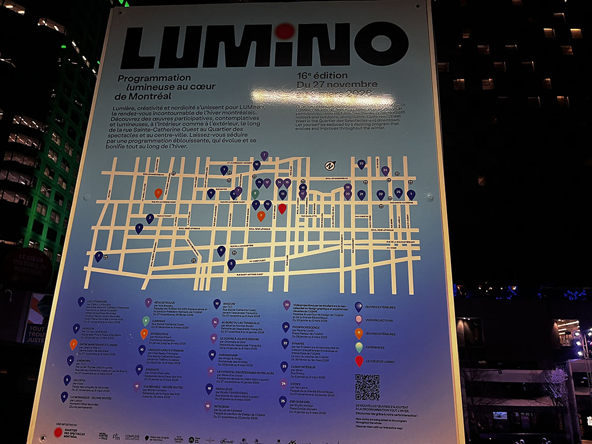
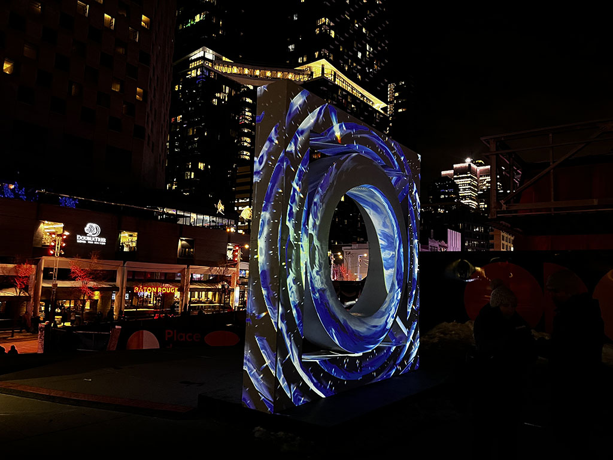
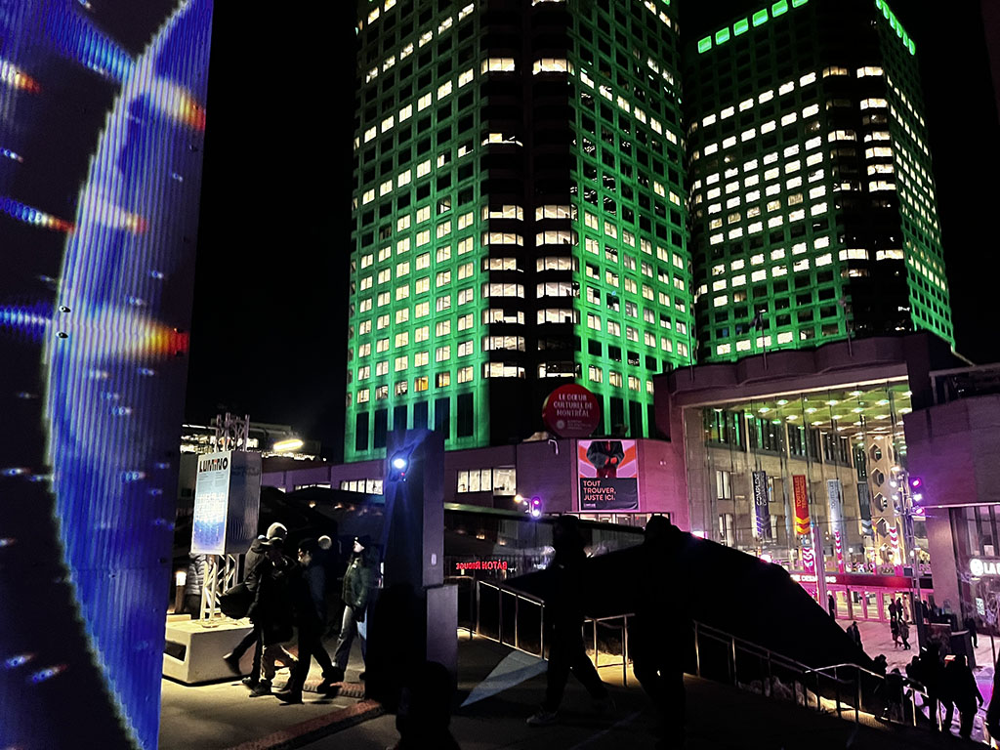
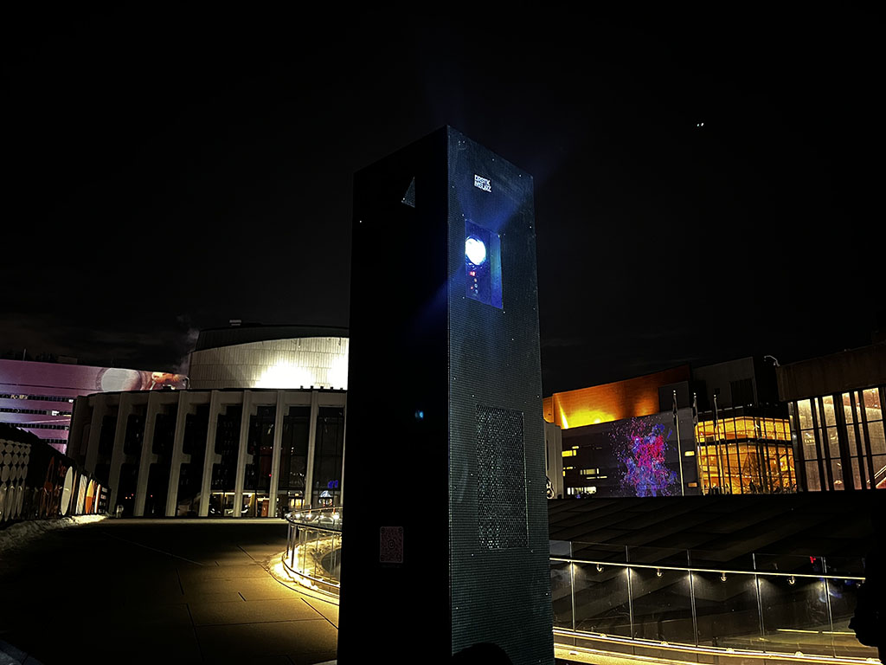

# EXPOSITON LUMINO | STARGATE
___
## Lieu de l'exposition 
Montréal, Centre-Ville (toit de la salle Wilfrid Pelltier)📍
 
Proche de la staion Place Des Arts (Ligne 1 Verte) 🟢 
___
## À propos de l'expo
sous une trame sonore  captivante et douce, de différentes forme avec des couleurs changeantes en continue. Elles sont projeté par deux projecteur. Un à l'avant et un à l'arrière, sur une sculpture en forme de carré.
cette exposition a lieu durant le soir puisque qu'elle a été conçu pour donner un effet réflectif.
___
## description de l'expo sur place 

___
## Photos

> Voici l'élément principale de l'exposition une sculpture en forme de carré. Il y avait un trou au millieu pour que les gens puisse s'assoir sur l'oeuvre et prendre des photos.
___
 

> Voici les des projecteurs qui permet de diffusé de la couleurs, et de l'animation sur la sulcpture montré dans la première photo.
___
## Expérience & Observations

J'avais des grandes attentes  sur l'exposition. Je m'attendais à une plus grande atmosphère et un plus grand terrain d'exposition, 
les oeuvres et les équipements permmetant à mettre l'exposition en vie était plutôt petit. Sur le site, l'expositon paraît beaucoup plus grand. Je m'attendais à une musique plus énergisante.
J'ai à peine passé 7 minutes sur les lieux. 
___
### Références
le site de l'exposition : https://www.luminomtl.com/fr/activites/oeuvres-exterieures/stargate 
